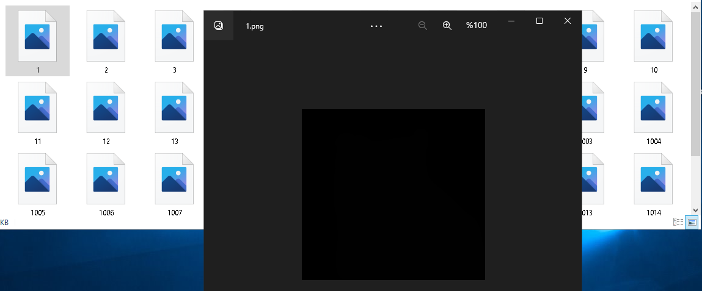

# mmSegmentation

## QuPath

Qupathte etiketlenen resimlerimiz hazır, Scripi çağırıyoruz ve sonucumuz;


Fakat bu resimler yeterli değil, siyah Mask haline çevirmemiz lazım.
Başka scripti çalıştıyoruz.



Siyah maskeli ve RGB resimleri uygun dosya formatına getiriyoruz ve daha önce clone ettiğimiz mmsegmentation/data içine yüklüyoruz.

```python
├── data
│   ├── my_dataset
│   │   ├── img_dir
│   │   │   ├── train
│   │   │   ├── val
│   │   ├── ann_dir
│   │   │   ├── train
│   │   │   ├── val

```

Datamızın yüklenmesi;


## mmSegmentation

- Register Dataset
  Yüklediğimiz Datamızı kayıt etmemiz lazım.
  ./mmseg/datasets/[custom.py](http://custom.py) konumunda mmSegmentation’un hazırladığı custom.py dosyasını kullanabiliriz.
  Yapmamız gereken Classes ve Palette kısımlarını doldurmak.
  Classes = QuPath’te etiketleme yaparken kullandığımız classlar
  Palette = Classların RGB değerleri
  Not: İstersek kendimiz yeni .py dosyası oluşturabiliriz, fakat aynı konumdaki ‘**init**.py’ dosyasına databasemizi kayıt etmemiz lazım.
  
- Customize Dataset ve CFG İslemleri
  İlgili Link için tıklayınız : [Customize Dataset](https://github.com/MengzhangLI/mmsegmentation/blob/add_doc_customization_dataset/docs/en/tutorials/customize_datasets.md)
  Hazır datasetler ve dosya konumları :[https://mmsegmentation.readthedocs.io/en/latest/dataset_prepare.html](https://mmsegmentation.readthedocs.io/en/latest/dataset_prepare.html)
  1- Bu adımda Cfg ve gerekli dosyalarda işlemler yapacağız.
  Öncelikle CFG dosyamıza bakalım yani aşağıda yazan cfg konumuna gideceğiz.
  ```python
  from mmcv import Config
  cfg = Config.fromfile('configs/pspnet/pspnet_r50-d8_512x1024_40k_cityscapes.py')
  ```
  2- Konuma gittiğimizde 4 adet dosya bizi karşılıyor.
  
  Değiştirmemiz gerekenler kırmızı kutu içindeki dosyalar.
  Not : CFG dosyamız cityscapes dataseti için yazılmış, biz bunu kendi datasetimize çevireceğiz. İstersek yeni cfg dosyası oluışturup bu işlemi yapabiliriz ama ben eski dosyayı değiştirmeyi seçiyorum.
  2-1) '../_base_/models/pspnet_r50-d8.py'
  Bu dosyamızda class sayılarımızı güncelleyeceğiz.
  Benim datasetimde 3 adet class var.(Background, Cat , Dog)
  
  2-2)'../_base_/datasets/cityscapes.py'
  Bu dosya datamızın config dosyasıdır. Biz aynı konumda ‘my_dataset_config.py’ isminde dosya açacağız yani kendi config dosyamızı oluşturacağız.(aslında bu adımda aynı konumdaki başka bir config dosyasını kopyalıyoruz, ileride config dosyamızı uygun duruma göre güncelleyeceğiz)
  Kullandığım Config:
  Mor kutu içindekiler değiştirdiğimiz satırlar.
  dataset_type = Register Data kısmındaki .py uzantılı dosyadaki classlarmızı kayıt ettiğimiz Fonksiyon olan Class’ın ismi
  data_root = datamızın konumu
  
- Training
  CFG dosyamızı tanımladığımız kod hücresinin altındaki hücrede CFG dosyamızı çağırırken dikkat edilmesi gereken kısımlar;
  ```python
  cfg_data_root = data_root+dataset
  train_img_dir = 'img_dir/train'
  train_ann_dir = 'ann_dir/train'
  val_img_dir = 'img_dir/val'
  val_ann_dir = 'ann_dir/val'
  ```
  ```python
  # Modify dataset type and path
  cfg.dataset_type = 'CustomDataset'
  cfg.data_root = cfg_data_root
  ```
- Sonuçlar (400iterasyon)
  
  Mor: Background
  Kırmızı : Kedi
  Sarı : Köpek
  
